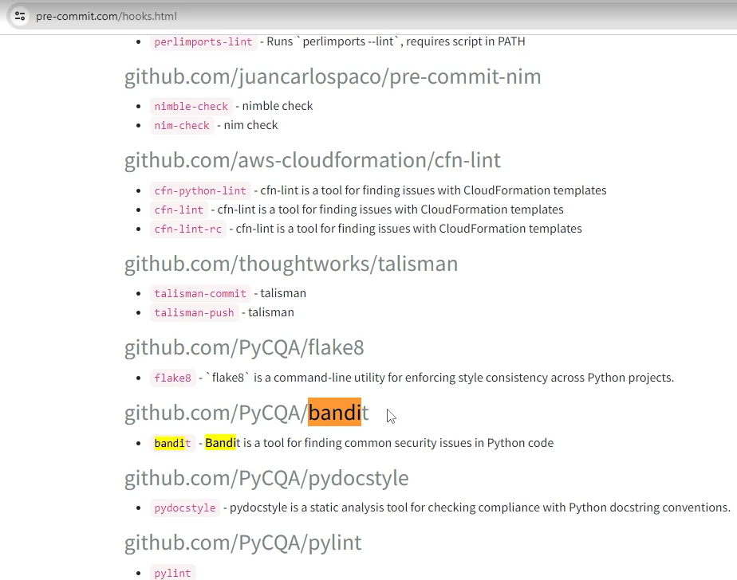

# aula06_bootcamp

O objetivo deste exercico é a criação de ambientes virtuais e um pre-commit para projetos.

Neste exercicio utilizamos as ferramentas FLAKE8 / ISORT / BLACK / BLUE / TASKIPY para analise de código-fonte em busca de possíveis erros, estilo de código inconsistente e outras questões relacionadas à qualidade do código.

Tambem podemos adicionar ferramentas de segurança como (BANDIT) dentre as diversas existentes.

